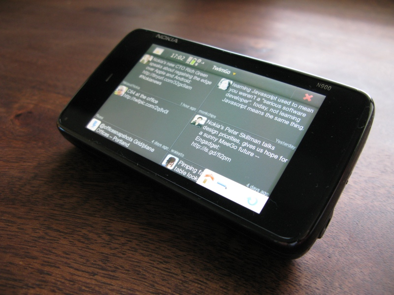

# TwimGo

*Note:* Application hasn't been in active development ever since Nokia stopped producing Maemo/Meego devices.

Twimgo is a mobile Twitter client written in Qt/QML/JavaScript mainly for MeeGo and Maemo devices. Contains all the basic functions like home, mentions, favourites etc. timelines, search, lists, trends. You can also easily open links and search mentioned hashtags. TwitPic, Instagram and yFrog photo preview is shown in tweet details.

## Screenshots

TwimGo in landscape mode

TwimGo running on Nokia N900
